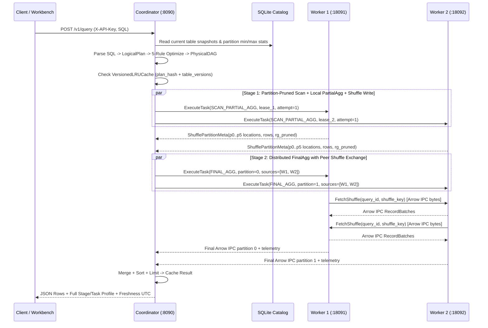
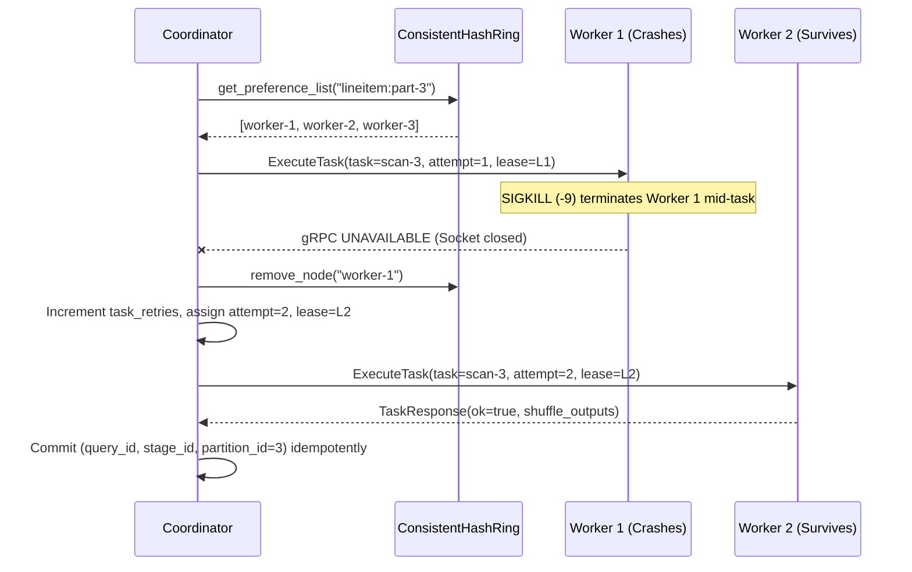

# Core Execution & Recovery Sequence Diagrams

## 1. Distributed Two-Phase Hash Aggregation with Peer Arrow IPC Shuffle

```mermaid
sequenceDiagram
    participant C as Client / Workbench
    participant Coord as Coordinator (:8090)
    participant Cat as SQLite Catalog
    participant W1 as Worker 1 (:18091)
    participant W2 as Worker 2 (:18092)

    C->>Coord: POST /v1/query (X-API-Key, SQL)
    Coord->>Cat: Read current table snapshots & partition min/max stats
    Coord->>Coord: Parse SQL -> LogicalPlan -> 5-Rule Optimize -> PhysicalDAG
    Coord->>Coord: Check VersionedLRUCache (plan_hash + table_versions)

    par Stage 1: Partition-Pruned Scan + Local PartialAgg + Shuffle Write
        Coord->>W1: ExecuteTask(SCAN_PARTIAL_AGG, lease_1, attempt=1)
        Coord->>W2: ExecuteTask(SCAN_PARTIAL_AGG, lease_2, attempt=1)
    end
    W1-->>Coord: ShufflePartitionMeta(p0..p5 locations, rows, rg_pruned)
    W2-->>Coord: ShufflePartitionMeta(p0..p5 locations, rows, rg_pruned)

    par Stage 2: Distributed FinalAgg with Peer Shuffle Exchange
        Coord->>W1: ExecuteTask(FINAL_AGG, partition=0, sources=[W1, W2])
        Coord->>W2: ExecuteTask(FINAL_AGG, partition=1, sources=[W1, W2])
    end
    W1->>W2: FetchShuffle(query_id, shuffle_key) [Arrow IPC bytes]
    W2-->>W1: Arrow IPC RecordBatches
    W2->>W1: FetchShuffle(query_id, shuffle_key) [Arrow IPC bytes]
    W1-->>W2: Arrow IPC RecordBatches

    W1-->>Coord: Final Arrow IPC partition 0 + telemetry
    W2-->>Coord: Final Arrow IPC partition 1 + telemetry
    Coord->>Coord: Merge + Sort + Limit -> Cache Result
    Coord-->>C: JSON Rows + Full Stage/Task Profile + Freshness UTC
```

## 2. Mid-Query Worker Crash Recovery & Idempotent Commit

```mermaid
sequenceDiagram
    participant Coord as Coordinator
    participant Ring as ConsistentHashRing
    participant W1 as Worker 1 (Crashes)
    participant W2 as Worker 2 (Survives)

    Coord->>Ring: get_preference_list("lineitem:part-3")
    Ring-->>Coord: [worker-1, worker-2, worker-3]
    Coord->>W1: ExecuteTask(task=scan-3, attempt=1, lease=L1)
    Note over W1: SIGKILL (-9) terminates Worker 1 mid-task
    W1--xCoord: gRPC UNAVAILABLE (Socket closed)
    Coord->>Ring: remove_node("worker-1")
    Coord->>Coord: Increment task_retries, assign attempt=2, lease=L2
    Coord->>W2: ExecuteTask(task=scan-3, attempt=2, lease=L2)
    W2-->>Coord: TaskResponse(ok=true, shuffle_outputs)
    Coord->>Coord: Commit (query_id, stage_id, partition_id=3) idempotently
```
